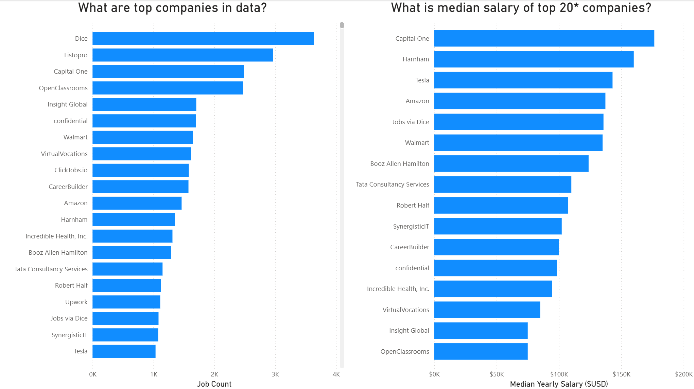
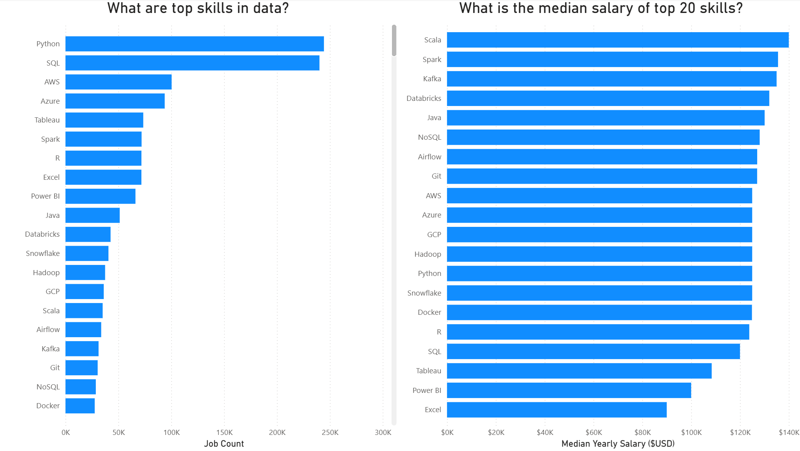
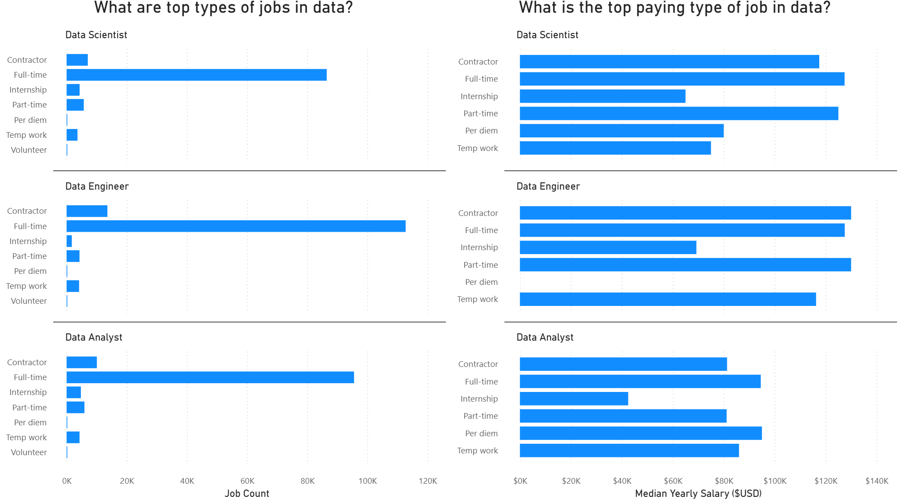
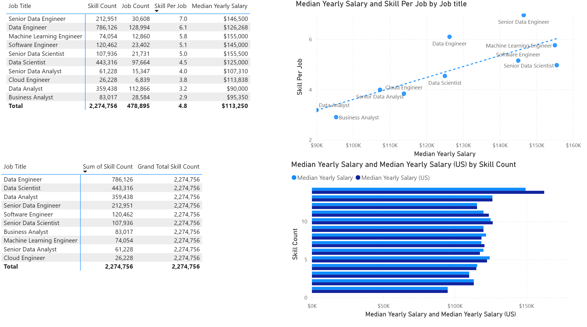
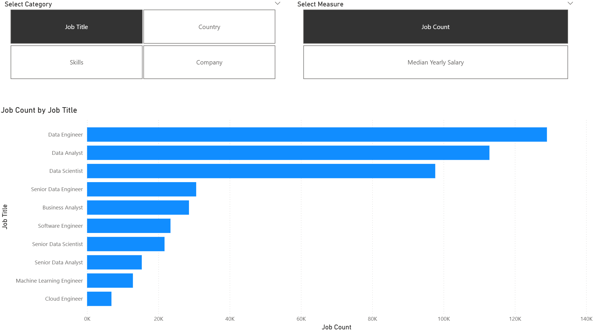

# 📊 Data Professional Market Analysis Dashboard
This project provides a deep dive into the data science and engineering job market. Using Power BI, I analyzed a dataset of job postings to uncover the most in-demand skills, top-paying roles, and company-specific trends to help data professionals make data-driven career decisions.

## 🚀 Project Overview
The goal of this project was to answer critical questions for job seekers and recruiters:

Which companies are hiring the most for data roles?

What are the top-paying skills in the current market?

How do job titles (Data Engineer vs. Data Scientist) compare in terms of salary and skill requirements?

What is the impact of different employment types (Contract vs. Full-time) on compensation?

## 📂 Dashboard Breakdown
### 🏢 Company & Salary Insights
The first page focuses on the "where" and "how much." It identifies top hiring companies like Dice, Listopro, and Capital One. Interestingly, while some companies have a high volume of postings, companies like Capital One and Tesla lead in median salary offerings.

### 🛠️ Skill Demand & Value
This section separates skills by popularity and profitability.

Most Popular: Python, SQL, and AWS dominate the job count.

Highest Paying: Niche skills like Unreal Engine, Golang, and Haskell command the highest median salaries, often exceeding $150k.

### 📈 Job Roles & Salary Distributions
A detailed breakdown of roles (Data Scientist, Data Engineer, Data Analyst) across different schedule types.

Key Finding: Data Engineers currently lead in job volume, while Machine Learning Engineers and Senior Data Scientists represent the top tier of compensation.

The project also includes a distribution of hourly wages to show the density of pay ranges across the industry.

### 🧪 Skills vs. Salary Correlation
Using scatter plots and detailed tables, this page explores the relationship between the number of skills required per job and the offered salary. It helps visualize whether "skill stacking" actually leads to higher pay for specific roles.

### 🧮 Dynamic Parameters & "Take-Home" Pay
I implemented interactive parameters that allow users to:

Toggle between different categories (Job Title, Country, Skills).

Adjust Deduction Rates (Taxes/Insurance) to calculate an estimated "Take-Home Pay" dynamically from the gross median salary.

## 🛠️ Tools Used
Power BI: Data visualization, DAX (Data Analysis Expressions), and dashboard design.

Power Query: Data cleaning and transformation (ETL).

Data Modeling: Established relationships between company, date, job postings, and skill dimensions.
